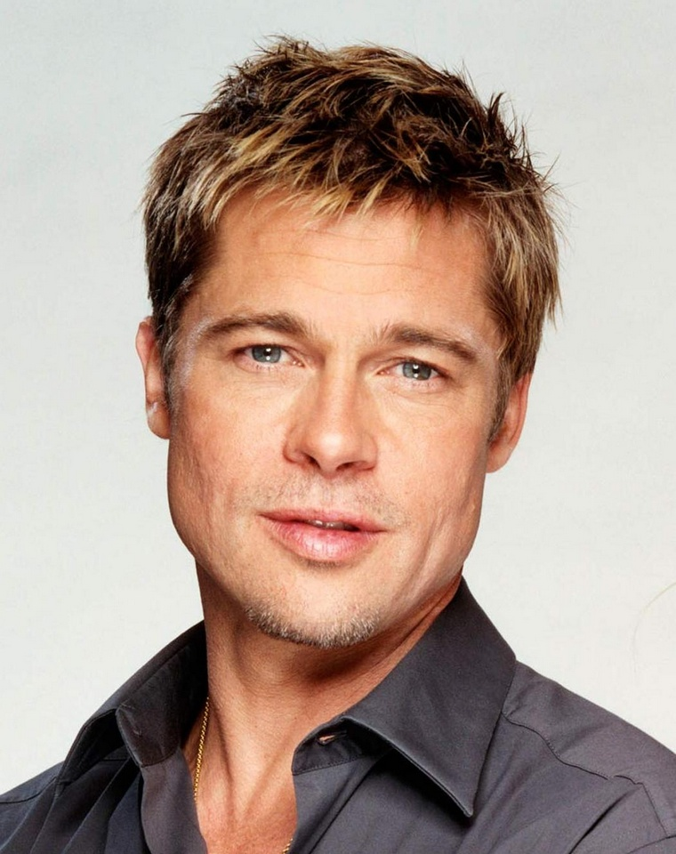
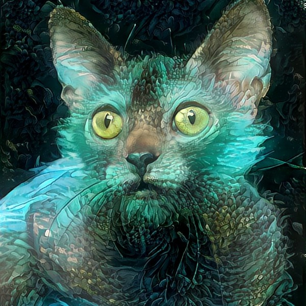
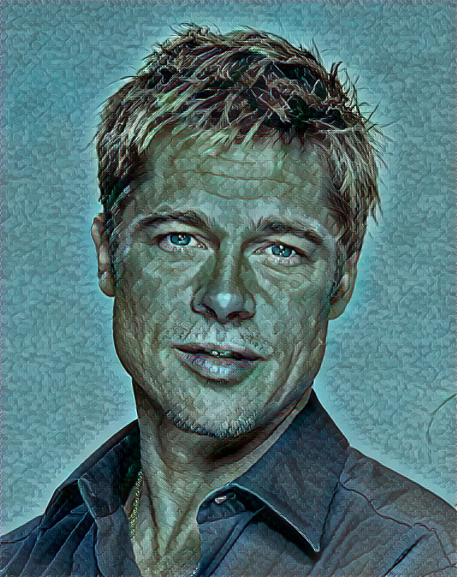
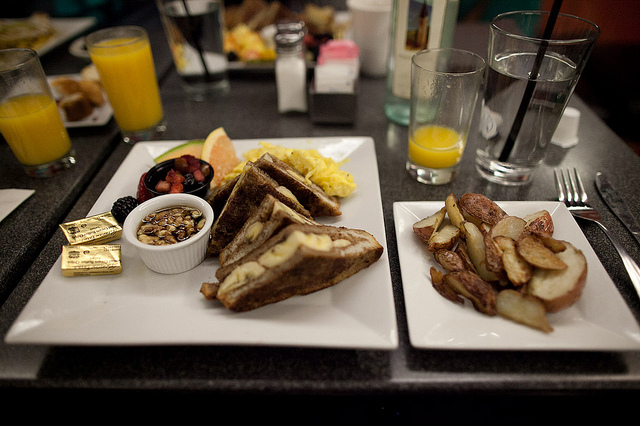
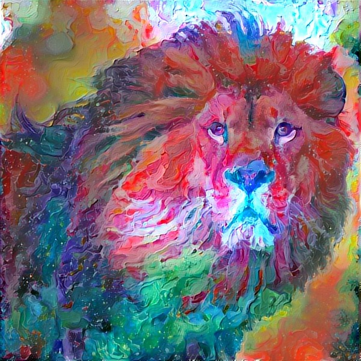
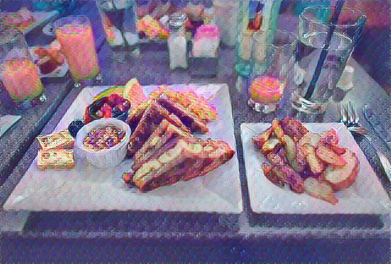
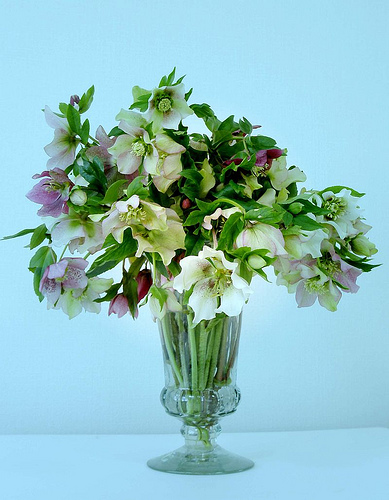
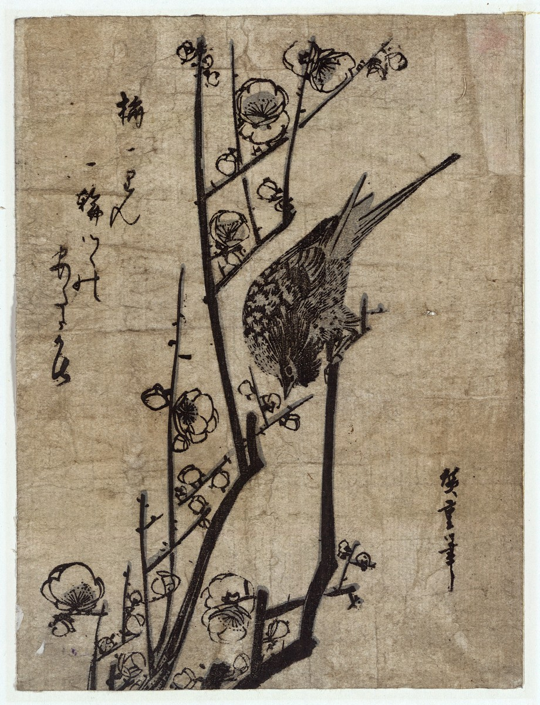
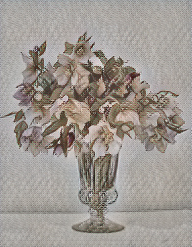

## Adaptive Style Transfer in TensorFlow and TensorLayer

> Update:
> - (15/05/2020) Migrated to TensorLayer2 (backend=TensorFlow 2.x). Original TL1 code can be found [here](https://github.com/tensorlayer/adaptive-style-transfer/tree/tl1).

Before ["Arbitrary Style Transfer in Real-time with Adaptive Instance Normalization"](https://arxiv.org/abs/1703.06868),
there were two main approaches for style transfer. First, given one content image and one style image, we randomly initialize a noise image and update it to get the output image. The drawback of this apporach is slow, it usually takes 3 mins to get one image.
After that, academic proposed to train one model for one specific style, which input one image to network, and output one image. This approach is far more faster than the previous approach, and achieved real-time style transfer.

However, one model for one style still not good enough for production. If a mobile APP want to support 100 styles offline, it is impossible to store 100 models in the cell phone. Adaptive style transfer which in turn supports arbitrary styles in one single model !!! We don't need to train new model for new style. Just simply input one content image and one style image you want !!!

⚠️ ⚠️ **This repo will be moved into [here](https://github.com/tensorlayer/tensorlayer/tree/master/examples) (please star) for life-cycle management soon. More cool Computer Vision applications such as pose estimation and style transfer can be found in this [organization](https://github.com/tensorlayer).**


### Usage

1. Install TensorFlow and the master of TensorLayer:
    ```
    pip install git+https://github.com/tensorlayer/tensorlayer.git
    ```

2. You can use the  <b>train.py</b> script to train your own model. To train the model, you need to download [MSCOCO dataset](http://cocodataset.org/#download) and [Wikiart dataset](https://www.kaggle.com/c/painter-by-numbers), and put the dataset images under the <b>'dataset/content_samples'</b> folder and <b>'dataset/style_samples'</b> folder.

3. You can then use the <b>test.py</b> script to run your trained model. Remember to put it into the <b>'pretrained_models'</b> folder and rename it to 'dec_best_weights.h5'. A pretrained model can be downloaded from [here](https://github.com/tensorlayer/adaptive-style-transfer/tree/tl1to2/pretrained_models), which is for TensorLayer v2 and a decoder using _DeConv2d_ layers.

4. You may compare this TL2 version with its precedent TL1 version branch to learn about how to migrate TL1 samples. There are also plenty of comments in code tagged with 'TL1to2:' for your reference.


### Results

Here are some result images (Left to Right: Content , Style , Result):

<div align="center">
   
   
   
</div>

<div align="center">
   
   
   
</div>

<div align="center">
   
   
   
</div>

Enjoy !

### Discussion

- [TensorLayer Slack](https://join.slack.com/t/tensorlayer/shared_invite/enQtMjUyMjczMzU2Njg4LWI0MWU0MDFkOWY2YjQ4YjVhMzI5M2VlZmE4YTNhNGY1NjZhMzUwMmQ2MTc0YWRjMjQzMjdjMTg2MWQ2ZWJhYzc)
- [TensorLayer WeChat](https://github.com/tensorlayer/tensorlayer-chinese/blob/master/docs/wechat_group.md)

### License

- This project is for academic use only.
